# Use Case Diagram

## Use Case Diagram (PlantUML)

```plantuml
@startuml EventMN Use Case Diagram

left to right direction
skinparam packageStyle rectangle
skinparam actorStyle awesome

' Actors
actor "Зочин\n(Guest)" as Guest
actor "Хэрэглэгч\n(User)" as User
actor "Зохион байгуулагч\n(Organizer)" as Organizer
actor "Админ\n(Admin)" as Admin

' Inheritance
User -|> Guest
Organizer -|> User
Admin -|> Organizer

' System boundary
rectangle "EventMN System" {
    
    ' === Authentication Package ===
    package "Нэвтрэлт (Authentication)" {
        usecase "Бүртгүүлэх" as UC_Register
        usecase "OTP баталгаажуулах" as UC_VerifyOTP
        usecase "Нэвтрэх" as UC_Login
        usecase "Гарах" as UC_Logout
        usecase "Нууц үг сэргээх" as UC_ResetPassword
        usecase "Token шинэчлэх" as UC_RefreshToken
    }
    
    ' === Event Package ===
    package "Эвент (Event Management)" {
        usecase "Эвент жагсаалт харах" as UC_ListEvents
        usecase "Эвент хайх" as UC_SearchEvents
        usecase "Эвент дэлгэрэнгүй харах" as UC_ViewEvent
        usecase "Эвент үүсгэх" as UC_CreateEvent
        usecase "Эвент засах" as UC_EditEvent
        usecase "Эвент цуцлах" as UC_CancelEvent
        usecase "Миний эвентүүд харах" as UC_MyEvents
        usecase "Эвент зөвшөөрөх" as UC_ApproveEvent
        usecase "Эвент татгалзах" as UC_RejectEvent
    }
    
    ' === Venue Package ===
    package "Байршил (Venue)" {
        usecase "Venue жагсаалт харах" as UC_ListVenues
        usecase "Venue үүсгэх" as UC_CreateVenue
        usecase "Venue засах" as UC_EditVenue
    }
    
    ' === Booking Package ===
    package "Захиалга (Booking)" {
        usecase "Суудал сонгох" as UC_SelectSeats
        usecase "Суудал түгжих" as UC_LockSeats
        usecase "Захиалга үүсгэх" as UC_CreateBooking
        usecase "Захиалга баталгаажуулах" as UC_ConfirmBooking
        usecase "Захиалга цуцлах" as UC_CancelBooking
        usecase "Миний захиалгууд харах" as UC_MyBookings
        usecase "Захиалга дэлгэрэнгүй харах" as UC_ViewBooking
    }
    
    ' === Notification Package ===
    package "Мэдэгдэл (Notification)" {
        usecase "Мэдэгдэл хүлээн авах" as UC_ReceiveNotification
        usecase "Мэдэгдлүүд харах" as UC_ViewNotifications
        usecase "Мэдэгдэл уншсан тэмдэглэх" as UC_MarkRead
    }
    
    ' === Admin Package ===
    package "Админ (Administration)" {
        usecase "Хэрэглэгчид харах" as UC_ListUsers
        usecase "Хэрэглэгчийн role өөрчлөх" as UC_ChangeRole
        usecase "Бүх захиалга харах" as UC_AllBookings
        usecase "Системийн тохиргоо" as UC_Settings
    }
}

' === Guest Relationships ===
Guest --> UC_Register
Guest --> UC_ListEvents
Guest --> UC_SearchEvents
Guest --> UC_ViewEvent
Guest --> UC_ListVenues

' === User Relationships ===
User --> UC_Login
User --> UC_Logout
User --> UC_VerifyOTP
User --> UC_ResetPassword
User --> UC_RefreshToken
User --> UC_SelectSeats
User --> UC_LockSeats
User --> UC_CreateBooking
User --> UC_ConfirmBooking
User --> UC_CancelBooking
User --> UC_MyBookings
User --> UC_ViewBooking
User --> UC_ReceiveNotification
User --> UC_ViewNotifications
User --> UC_MarkRead

' === Organizer Relationships ===
Organizer --> UC_CreateEvent
Organizer --> UC_EditEvent
Organizer --> UC_CancelEvent
Organizer --> UC_MyEvents

' === Admin Relationships ===
Admin --> UC_ApproveEvent
Admin --> UC_RejectEvent
Admin --> UC_CreateVenue
Admin --> UC_EditVenue
Admin --> UC_ListUsers
Admin --> UC_ChangeRole
Admin --> UC_AllBookings
Admin --> UC_Settings

' === Include Relationships ===
UC_Register ..> UC_VerifyOTP : <<include>>
UC_CreateBooking ..> UC_LockSeats : <<include>>
UC_ConfirmBooking ..> UC_ReceiveNotification : <<include>>
UC_CancelBooking ..> UC_ReceiveNotification : <<include>>
UC_ApproveEvent ..> UC_ReceiveNotification : <<include>>
UC_RejectEvent ..> UC_ReceiveNotification : <<include>>

' === Extend Relationships ===
UC_CancelBooking ..> UC_ViewBooking : <<extend>>
UC_EditEvent ..> UC_ViewEvent : <<extend>>

@enduml
```



## Use Case Тодорхойлолтууд

### UC-01: Бүртгүүлэх (Register)

| Талбар | Тодорхойлолт |
|--------|--------------|
| **Use Case ID** | UC-01 |
| **Нэр** | Бүртгүүлэх |
| **Оролцогч** | Зочин |
| **Тодорхойлолт** | Шинэ хэрэглэгч системд бүртгүүлэх |
| **Урьдчилсан нөхцөл** | Хэрэглэгч системд бүртгэлгүй байх |
| **Үндсэн урсгал** | 1. Хэрэглэгч бүртгэлийн хуудас руу орно<br>2. Имэйл, нууц үг, нэр оруулна<br>3. Систем мэдээллийг шалгана<br>4. Хэрэглэгчийн бүртгэл үүснэ<br>5. OTP код имэйлээр илгээнэ |
| **Дараах нөхцөл** | Хэрэглэгч үүссэн, OTP баталгаажуулалт хүлээж байна |
| **Алдааны урсгал** | 3а. Имэйл бүртгэлтэй бол алдаа буцаана |

### UC-02: Нэвтрэх (Login)

| Талбар | Тодорхойлолт |
|--------|--------------|
| **Use Case ID** | UC-02 |
| **Нэр** | Нэвтрэх |
| **Оролцогч** | Хэрэглэгч |
| **Тодорхойлолт** | Хэрэглэгч системд нэвтрэх |
| **Урьдчилсан нөхцөл** | Хэрэглэгч бүртгэлтэй, баталгаажсан байх |
| **Үндсэн урсгал** | 1. Хэрэглэгч нэвтрэх хуудас руу орно<br>2. Имэйл, нууц үг оруулна<br>3. Систем мэдээллийг шалгана<br>4. Access token, Refresh token олгоно<br>5. Хэрэглэгч нүүр хуудас руу шилжинэ |
| **Дараах нөхцөл** | Хэрэглэгч нэвтэрсэн, token хүчинтэй |
| **Алдааны урсгал** | 3а. Буруу мэдээлэл бол алдаа<br>3б. Баталгаажаагүй бол OTP хуудас руу |

### UC-03: Эвент үүсгэх (Create Event)

| Талбар | Тодорхойлолт |
|--------|--------------|
| **Use Case ID** | UC-03 |
| **Нэр** | Эвент үүсгэх |
| **Оролцогч** | Зохион байгуулагч |
| **Тодорхойлолт** | Шинэ эвент үүсгэх |
| **Урьдчилсан нөхцөл** | Хэрэглэгч ORGANIZER role-тэй нэвтэрсэн байх |
| **Үндсэн урсгал** | 1. Эвент үүсгэх хуудас руу орно<br>2. Мэдээлэл оруулна (нэр, тайлбар, огноо, үнэ, venue)<br>3. Систем мэдээллийг шалгана<br>4. Эвент PENDING төлөвтэй үүснэ<br>5. Админ руу мэдэгдэл илгээнэ |
| **Дараах нөхцөл** | Эвент үүссэн, админ зөвшөөрөл хүлээж байна |
| **Алдааны урсгал** | 3а. Шаардлагатай талбар дутуу бол алдаа |

### UC-04: Суудал түгжих (Lock Seats)

| Талбар | Тодорхойлолт |
|--------|--------------|
| **Use Case ID** | UC-04 |
| **Нэр** | Суудал түгжих |
| **Оролцогч** | Хэрэглэгч |
| **Тодорхойлолт** | Хэрэглэгч сонгосон суудлуудаа 10 минутын турш түгжих |
| **Урьдчилсан нөхцөл** | Хэрэглэгч нэвтэрсэн, эвент сонгосон байх |
| **Үндсэн урсгал** | 1. Хэрэглэгч суудлуудыг сонгоно<br>2. Систем суудлууд чөлөөтэй эсэхийг шалгана<br>3. Redis-д 10 минутын TTL-тэй түгжинэ<br>4. Countdown timer эхэлнэ |
| **Дараах нөхцөл** | Суудлууд түгжигдсэн, 10 мин дотор захиалах |
| **Алдааны урсгал** | 2а. Суудал түгжигдсэн бол алдаа<br>3а. 10 суудлаас их бол алдаа |

### UC-05: Захиалга баталгаажуулах (Confirm Booking)

| Талбар | Тодорхойлолт |
|--------|--------------|
| **Use Case ID** | UC-05 |
| **Нэр** | Захиалга баталгаажуулах |
| **Оролцогч** | Хэрэглэгч |
| **Тодорхойлолт** | PENDING захиалгыг баталгаажуулах |
| **Урьдчилсан нөхцөл** | PENDING төлөвтэй захиалга байх, суудлууд түгжигдсэн |
| **Үндсэн урсгал** | 1. Хэрэглэгч баталгаажуулах товч дарна<br>2. Систем захиалгын мэдээллийг шалгана<br>3. Захиалга CONFIRMED болно<br>4. Эвентийн availableSeats буурна<br>5. Баталгаажуулах имэйл илгээнэ |
| **Дараах нөхцөл** | Захиалга баталгаажсан, суудлууд бүрмөсөн эзэмшигдсэн |
| **Алдааны урсгал** | 2а. Суудлын түгжээ дууссан бол алдаа |

### UC-06: Захиалга цуцлах (Cancel Booking)

| Талбар | Тодорхойлолт |
|--------|--------------|
| **Use Case ID** | UC-06 |
| **Нэр** | Захиалга цуцлах |
| **Оролцогч** | Хэрэглэгч |
| **Тодорхойлолт** | Баталгаажсан захиалгыг цуцлах |
| **Урьдчилсан нөхцөл** | CONFIRMED төлөвтэй захиалга байх |
| **Үндсэн урсгал** | 1. Хэрэглэгч цуцлах товч дарна<br>2. Систем буцаалтын хувийг тооцоолно<br>3. Захиалга CANCELLED болно<br>4. Суудлууд чөлөөлөгдөнө<br>5. Эвентийн availableSeats нэмэгдэнэ<br>6. Цуцлах имэйл илгээнэ |
| **Дараах нөхцөл** | Захиалга цуцлагдсан, буцаалт хийгдсэн |
| **Алдааны урсгал** | 2а. Эвент эхэлсэн бол алдаа |

### UC-07: Эвент зөвшөөрөх (Approve Event)

| Талбар | Тодорхойлолт |
|--------|--------------|
| **Use Case ID** | UC-07 |
| **Нэр** | Эвент зөвшөөрөх |
| **Оролцогч** | Админ |
| **Тодорхойлолт** | PENDING эвентийг зөвшөөрөх |
| **Урьдчилсан нөхцөл** | PENDING төлөвтэй эвент байх, Админ нэвтэрсэн |
| **Үндсэн урсгал** | 1. Админ эвентийн дэлгэрэнгүйг харна<br>2. Нийтлэх товч дарна<br>3. Эвент PUBLISHED болно<br>4. Зохион байгуулагч руу мэдэгдэл илгээнэ |
| **Дараах нөхцөл** | Эвент зөвшөөрөгдсөн, олон нийтэд харагдана |

## Use Case Diagram (ASCII Art)

```
                                    ┌─────────────────────────────────────────────────────────────┐
                                    │                    EventMN System                           │
                                    │                                                             │
    ┌─────────┐                     │   ┌─────────────────────────────────────────────────┐      │
    │  Зочин  │────────────────────────►│               Authentication                     │      │
    │ (Guest) │                     │   │  ○ Бүртгүүлэх ──────► ○ OTP баталгаажуулах      │      │
    └────┬────┘                     │   │  ○ Нэвтрэх                                       │      │
         │                          │   │  ○ Нууц үг сэргээх                               │      │
         │                          │   └─────────────────────────────────────────────────┘      │
         │                          │                                                             │
         ▼                          │   ┌─────────────────────────────────────────────────┐      │
    ┌─────────┐                     │   │               Event Management                   │      │
    │Хэрэглэгч│────────────────────────►│  ○ Эвент жагсаалт харах                          │      │
    │ (User)  │                     │   │  ○ Эвент хайх                                    │      │
    └────┬────┘                     │   │  ○ Эвент дэлгэрэнгүй харах                       │      │
         │                          │   └─────────────────────────────────────────────────┘      │
         │                          │                                                             │
         │                          │   ┌─────────────────────────────────────────────────┐      │
         │                          │   │                   Booking                        │      │
         ├─────────────────────────────►│  ○ Суудал сонгох/түгжих                          │      │
         │                          │   │  ○ Захиалга үүсгэх/баталгаажуулах               │      │
         │                          │   │  ○ Захиалга цуцлах                               │      │
         │                          │   │  ○ Миний захиалгууд                              │      │
         │                          │   └─────────────────────────────────────────────────┘      │
         │                          │                                                             │
         ▼                          │   ┌─────────────────────────────────────────────────┐      │
    ┌─────────┐                     │   │            Organizer Functions                   │      │
    │ Зохион  │────────────────────────►│  ○ Эвент үүсгэх                                  │      │
    │байгуулагч                     │   │  ○ Эвент засах                                   │      │
    └────┬────┘                     │   │  ○ Эвент цуцлах                                  │      │
         │                          │   │  ○ Миний эвентүүд                                │      │
         │                          │   └─────────────────────────────────────────────────┘      │
         │                          │                                                             │
         ▼                          │   ┌─────────────────────────────────────────────────┐      │
    ┌─────────┐                     │   │              Admin Functions                     │      │
    │  Админ  │────────────────────────►│  ○ Эвент зөвшөөрөх/татгалзах                    │      │
    │ (Admin) │                     │   │  ○ Хэрэглэгчид удирдах                           │      │
    └─────────┘                     │   │  ○ Venue удирдах                                 │      │
                                    │   │  ○ Бүх захиалгууд харах                          │      │
                                    │   └─────────────────────────────────────────────────┘      │
                                    │                                                             │
                                    │   ┌─────────────────────────────────────────────────┐      │
                                    │   │               Notifications                      │      │
                                    │   │  ○ Мэдэгдэл хүлээн авах                          │      │
                                    │   │  ○ Мэдэгдлүүд харах                              │      │
                                    │   └─────────────────────────────────────────────────┘      │
                                    │                                                             │
                                    └─────────────────────────────────────────────────────────────┘
```

## Оролцогчдын товч тодорхойлолт

| Оролцогч | Тодорхойлолт | Үндсэн Use Case-ууд |
|----------|--------------|---------------------|
| Зочин | Бүртгэлгүй хэрэглэгч | Эвент үзэх, хайх, бүртгүүлэх |
| Хэрэглэгч | Бүртгэлтэй хэрэглэгч | Захиалга хийх, цуцлах, мэдэгдэл харах |
| Зохион байгуулагч | Эвент зохион байгуулагч | Эвент үүсгэх, засах, удирдах |
| Админ | Системийн админ | Эвент зөвшөөрөх, хэрэглэгч удирдах, venue удирдах |
