# Class Diagram

## Class Diagram (PlantUML)

```plantuml
@startuml EventMN Class Diagram

skinparam classAttributeIconSize 0
skinparam classFontSize 12
skinparam packageFontSize 14

' =====================================================
' USER SERVICE
' =====================================================
package "User Service" #LightBlue {
    
    enum UserRole {
        USER
        ORGANIZER
        ADMIN
    }
    
    enum OTPType {
        EMAIL
        SMS
        PASSWORD_RESET
    }
    
    class User {
        - id: UUID
        - email: String
        - password: String
        - firstName: String
        - lastName: String
        - phone: String
        - role: UserRole
        - isVerified: Boolean
        - createdAt: DateTime
        - updatedAt: DateTime
        --
        + register(data: RegisterDTO): User
        + login(email, password): TokenPair
        + verifyOTP(code: String): Boolean
        + updateProfile(data: UpdateDTO): User
        + changePassword(oldPwd, newPwd): Boolean
    }
    
    class OTP {
        - id: UUID
        - userId: UUID
        - code: String
        - type: OTPType
        - expiresAt: DateTime
        - verified: Boolean
        - createdAt: DateTime
        --
        + generate(userId, type): OTP
        + verify(code): Boolean
        + isExpired(): Boolean
    }
    
    class RefreshToken {
        - id: UUID
        - userId: UUID
        - token: String
        - expiresAt: DateTime
        - createdAt: DateTime
        --
        + generate(userId): RefreshToken
        + verify(token): Boolean
        + revoke(): void
    }
    
    class AuthService {
        + register(data: RegisterDTO): User
        + login(email, password): TokenPair
        + refreshToken(token): TokenPair
        + verifyOTP(userId, code): Boolean
        + resendOTP(userId): void
        + resetPassword(email): void
    }
    
    class UserService {
        + findById(id): User
        + findByEmail(email): User
        + updateProfile(id, data): User
        + changeRole(id, role): User
        + listUsers(filters): User[]
    }
    
    User "1" -- "*" OTP : has >
    User "1" -- "*" RefreshToken : has >
    AuthService ..> User : uses
    AuthService ..> OTP : uses
    AuthService ..> RefreshToken : uses
    UserService ..> User : manages
}

' =====================================================
' EVENT SERVICE
' =====================================================
package "Event Service" #LightGreen {
    
    enum EventStatus {
        DRAFT
        PENDING
        PUBLISHED
        CANCELLED
        COMPLETED
    }
    
    enum EventCategory {
        CONCERT
        CONFERENCE
        WORKSHOP
        MEETUP
        SPORTS
        WRESTLING
        EXHIBITION
        OTHER
    }

    enum VenueType {
        CONCERT_HALL
        CONFERENCE_ROOM
        ARENA
        WRESTLING_HALL
        SPORTS_HALL
        STADIUM
        OUTDOOR
        EXHIBITION_HALL
        ONLINE
        OTHER
    }
    
    class Event {
        - id: UUID
        - title: String
        - description: String
        - category: EventCategory
        - venueId: UUID?
        - venueName: String?
        - startDate: DateTime
        - endDate: DateTime
        - images: String[]
        - thumbnail: String?
        - organizerId: String
        - organizerName: String
        - status: EventStatus
        - isFeatured: Boolean
        - tags: String[]
        - ticketInfo: Json?
        - rejectionReason: String?
        - rejectedAt: DateTime?
        - rejectedBy: String?

        - isOnline: Boolean
        - meetingUrl: String?
        - meetingPlatform: String?
        - createdAt: DateTime
        - updatedAt: DateTime
        --
        + create(data: EventDTO): Event
        + update(data: EventDTO): Event
        + approve(): Event
        + reject(reason): Event
        + cancel(): Event
    }
    
    class Venue {
        - id: UUID
        - name: String
        - address: String
        - city: String
        - capacity: Int
        - venueType: VenueType
        - description: String?
        - images: String[]
        - sections: Json?
        - hasWrestlingRing: Boolean
        - hasBoxingRing: Boolean
        - hasTrack: Boolean
        - hasCourt: Boolean
        - hasParking: Boolean
        - hasLockerRoom: Boolean
        - hasShower: Boolean
        - createdBy: String
        - isActive: Boolean
        - createdAt: DateTime
        - updatedAt: DateTime
        --
        + create(data: VenueDTO): Venue
        + update(data: VenueDTO): Venue
    }
    
    class SeatMap {
        - sections: Json
        --
        + getTotalSeats(): Number
    }
    
    class EventService {
        + create(data, organizerId): Event
        + findById(id): Event
        + findAll(filters): Event[]
        + update(id, data): Event
        + delete(id): void
        + approve(id): Event
        + reject(id, reason): Event
        + getByOrganizer(organizerId): Event[]
    }
    
    class VenueService {
        + create(data): Venue
        + findById(id): Venue
        + findAll(): Venue[]
        + update(id, data): Venue
    }
    
    Event .. Venue : venueId (optional) >
    EventService ..> Event : manages
    VenueService ..> Venue : manages
}

' =====================================================
' BOOKING SERVICE
' =====================================================
package "Booking Service" #LightYellow {
    
    enum BookingStatus {
        PENDING
        CONFIRMED
        CANCELLED
        EXPIRED
    }
    
    class Booking {
        - id: UUID
        - userId: String
        - userEmail: String
        - userName: String
        - eventId: String
        - eventTitle: String
        - eventDate: DateTime
        - venueId: String
        - venueName: String
        - status: BookingStatus
        - totalAmount: Float
        - qrCode: String?
        - paymentId: String?
        - paymentMethod: String?
        - paidAt: DateTime?
        - createdAt: DateTime
        - updatedAt: DateTime
        --
        + create(data: BookingDTO): Booking
        + confirm(): Booking
        + cancel(reason): Booking
    }
    
    class BookingSeat {
        - id: UUID
        - bookingId: UUID
        - sectionId: String
        - sectionName: String
        - row: Int
        - seatNumber: Int
        - price: Float
        - createdAt: DateTime
        --
        + create(data): BookingSeat
    }
    
    class SeatLock {
        - eventId: String
        - sectionId: String
        - row: Int
        - seat: Int
        - userId: String
        - expiresAt: DateTime
        --
        + lock(eventId, seats, userId): Boolean
        + unlock(eventId, seats, userId): Boolean
        + isLocked(eventId, seat): Boolean
        + getLockedSeats(eventId): String[]
    }
    
    class BookingService {
        + create(userId, eventId, seats): Booking
        + confirm(bookingId): Booking
        + cancel(bookingId, reason): Booking
        + findById(id): Booking
        + findByUser(userId): Booking[]
        + findByEvent(eventId): Booking[]
    }
    
    class SeatService {
        + lockSeats(eventId, seats, userId): Boolean
        + unlockSeats(eventId, seats, userId): Boolean
        + getStatus(eventId): SeatStatus
        + extendLock(eventId, seats, userId): Boolean
    }
    
    Booking "1" -- "*" BookingSeat : contains >
    BookingService ..> Booking : manages
    BookingService ..> SeatLock : uses
    SeatService ..> SeatLock : manages
}

' =====================================================
' NOTIFICATION SERVICE
' =====================================================
package "Notification Service" #LightPink {
    
    enum NotificationType {
        BOOKING_CONFIRMED
        BOOKING_CANCELLED
        EVENT_REMINDER
        EVENT_UPDATED
        EVENT_CANCELLED
        SYSTEM
    }
    
    class Notification {
        - id: UUID
        - userId: String
        - type: NotificationType
        - title: String
        - message: String
        - data: Json?
        - isRead: Boolean
        - emailSent: Boolean
        - createdAt: DateTime
        - updatedAt: DateTime
        --
        + create(data): Notification
        + markAsRead(): Notification
    }
    
    class NotificationService {
        + create(data): Notification
        + send(notification): void
        + findByUser(userId): Notification[]
        + markAsRead(id): Notification
        + markAllAsRead(userId): void
    }
    
    class EmailService {
        + send(to, subject, body): Boolean
        + sendTemplate(to, template, data): Boolean
    }
    
    class MessageConsumer {
        + handleBookingConfirmed(data): void
        + handleBookingCancelled(data): void
        + handleEventApproved(data): void
        + handleEventRejected(data): void
        + handleEventReminder(data): void
    }
    
    NotificationService ..> Notification : manages
    NotificationService ..> EmailService : uses
    MessageConsumer ..> NotificationService : triggers
}

' =====================================================
' GATEWAY
' =====================================================
package "API Gateway" #LightGray {
    
    class Gateway {
        + routeRequest(path, method): Response
        + authenticate(token): User
        + authorize(user, resource): Boolean
    }
    
    class AuthMiddleware {
        + verifyToken(token): Payload
        + extractUser(payload): User
        + checkRole(user, roles): Boolean
    }
    
    class ProxyService {
        + forward(service, path, method, body): Response
        + getServiceUrl(service): String
    }
    
    Gateway ..> AuthMiddleware : uses
    Gateway ..> ProxyService : uses
}

' =====================================================
' RELATIONSHIPS BETWEEN SERVICES
' =====================================================

' Cross-service relationships (via IDs)
note "Services communicate via:\n- REST API calls\n- RabbitMQ messages\n- Shared user IDs" as N1

Event .. Booking : eventId
User .. Booking : userId
User .. Event : organizerId
Booking .. Notification : triggers

@enduml
```



## Class Diagram (ASCII Art)

```
┌─────────────────────────────────────────────────────────────────────────────────────────────────┐
│                                        USER SERVICE                                              │
├─────────────────────────────────────────────────────────────────────────────────────────────────┤
│                                                                                                  │
│  ┌─────────────────────┐    ┌─────────────────────┐    ┌─────────────────────┐                  │
│  │       <<enum>>      │    │       <<enum>>      │    │       <<enum>>      │                  │
│  │      UserRole       │    │       OTPType       │    │                     │                  │
│  ├─────────────────────┤    ├─────────────────────┤    ├─────────────────────┤                  │
│  │ USER                │    │ EMAIL               │    │                     │                  │
│  │ ORGANIZER           │    │ SMS                 │    │                     │                  │
│  │ ADMIN               │    │ PASSWORD_RESET      │    │                     │                  │
│  └─────────────────────┘    └─────────────────────┘    └─────────────────────┘                  │
│                                                                                                  │
│  ┌─────────────────────────────────┐         ┌─────────────────────────────────┐                │
│  │             User                │         │              OTP                │                │
│  ├─────────────────────────────────┤         ├─────────────────────────────────┤                │
│  │ - id: UUID                      │ 1    *  │ - id: UUID                      │                │
│  │ - email: String                 │────────►│ - userId: UUID                  │                │
│  │ - password: String              │         │ - code: String                  │                │
│  │ - firstName: String             │         │ - type: OTPType                 │                │
│  │ - lastName: String              │         │ - expiresAt: DateTime           │                │
│  │ - phone: String                 │         │ - verified: Boolean             │                │
│  │ - role: UserRole                │         ├─────────────────────────────────┤                │
│  │ - isVerified: Boolean           │         │ + generate(): OTP               │                │
│  │ - createdAt: DateTime           │         │ + verify(): Boolean             │                │
│  ├─────────────────────────────────┤         │ + isExpired(): Boolean          │                │
│  │ + register(): User              │         └─────────────────────────────────┘                │
│  │ + login(): TokenPair            │                                                            │
│  │ + verifyOTP(): Boolean          │         ┌─────────────────────────────────┐                │
│  │ + updateProfile(): User         │ 1    *  │         RefreshToken            │                │
│  │ + changePassword(): Boolean     │────────►├─────────────────────────────────┤                │
│  └─────────────────────────────────┘         │ - id: UUID                      │                │
│                                              │ - userId: UUID                  │                │
│                                              │ - token: String                 │                │
│                                              │ - expiresAt: DateTime           │                │
│                                              ├─────────────────────────────────┤                │
│                                              │ + generate(): RefreshToken      │                │
│                                              │ + verify(): Boolean             │                │
│                                              │ + revoke(): void                │                │
│                                              └─────────────────────────────────┘                │
└─────────────────────────────────────────────────────────────────────────────────────────────────┘

┌─────────────────────────────────────────────────────────────────────────────────────────────────┐
│                                       EVENT SERVICE                                              │
├─────────────────────────────────────────────────────────────────────────────────────────────────┤
│                                                                                                  │
│  ┌─────────────────────┐    ┌─────────────────────┐                                             │
│  │       <<enum>>      │    │       <<enum>>      │                                             │
│  │    EventStatus      │    │   EventCategory     │                                             │
│  ├─────────────────────┤    ├─────────────────────┤                                             │
│  │ DRAFT               │    │ CONCERT             │                                             │
│  │ PENDING             │    │ CONFERENCE          │                                             │
│  │ PUBLISHED           │    │ WORKSHOP            │                                             │
│  │                    │    │ MEETUP              │                                             │
│  │ CANCELLED           │    │ SPORTS              │                                             │
│  │ COMPLETED           │    │ WRESTLING           │                                             │
│  │                    │    │ EXHIBITION          │                                             │
│  │                    │    │ OTHER               │                                             │
│  └─────────────────────┘    └─────────────────────┘                                             │
│                                                                                                  │
│  ┌─────────────────────────────────┐         ┌─────────────────────────────────┐                │
│  │            Event                │         │            Venue                │                │
│  ├─────────────────────────────────┤         ├─────────────────────────────────┤                │
│  │ - id: UUID                      │         │ - id: UUID                      │                │
│  │ - title: String                 │ *    1  │ - name: String                  │                │
│  │ - description: String           │────────►│ - address: String               │                │
│  │ - category: EventCategory       │         │ - city: String                  │                │
│  │ - organizerId: String           │         │ - capacity: Int                 │                │
│  │ - venueId: UUID?                │         │ - sections: Json?               │◄───────┐       │
│  │ - startDate: DateTime           │         │                                │        │       │
│  │ - endDate: DateTime             │         ├─────────────────────────────────┤        │       │
│  │ - images: String[]              │         │ + create(): Venue               │   1    │       │
│  │ - thumbnail: String?            │         │ + update(): Venue               │        │       │
│  │ - organizerName: String         │                                                    │       │
│  │ - status: EventStatus           │         └─────────────────────────────────┘        │       │
│  │ - isFeatured: Boolean           │                                                    │       │
│  │ - tags: String[]                │         ┌─────────────────────────────────┐        │       │
│  ├─────────────────────────────────┤         │           SeatMap               │        │       │
│  │ + create(): Event               │         ├─────────────────────────────────┤    1   │       │
│  │ + update(): Event               │         │ - sections: Json                │────────┘       │
│  │ + approve(): Event              │         ├─────────────────────────────────┤                │
│  │ + reject(): Event               │         │ + getTotalSeats(): Number       │                │
│  │ + cancel(): Event               │                                                    │       │
│  └─────────────────────────────────┘         └─────────────────────────────────┘        │       │
│                                                                                     *   │       │
│                                                                                                  │
└─────────────────────────────────────────────────────────────────────────────────────────────────┘

┌─────────────────────────────────────────────────────────────────────────────────────────────────┐
│                                      BOOKING SERVICE                                             │
├─────────────────────────────────────────────────────────────────────────────────────────────────┤
│                                                                                                  │
│  ┌─────────────────────┐    ┌─────────────────────┐                                             │
│  │       <<enum>>      │    │       <<enum>>      │                                             │
│  │   BookingStatus     │    │                     │                                             │
│  ├─────────────────────┤    ├─────────────────────┤                                             │
│  │ PENDING             │    │                     │                                             │
│  │ CONFIRMED           │    │                     │                                             │
│  │ CANCELLED           │    │                     │                                             │
│  │ EXPIRED             │    └─────────────────────┘                                             │
│  └─────────────────────┘                                                                        │
│                                                                                                  │
│  ┌─────────────────────────────────┐         ┌─────────────────────────────────┐                │
│  │           Booking               │         │         BookingSeat             │                │
│  ├─────────────────────────────────┤         ├─────────────────────────────────┤                │
│  │ - id: UUID                      │ 1    *  │ - id: UUID                      │                │
│  │ - userId: String                │────────►│ - bookingId: UUID               │                │
│  │ - userEmail: String             │         │ - sectionId: String             │                │
│  │ - userName: String              │         │ - sectionName: String           │                │
│  │ - eventId: String               │         │ - row: Int                      │                │
│  │ - eventTitle: String            │         │ - seatNumber: Int               │                │
│  │ - eventDate: DateTime           │         │ - price: Float                  │                │
│  │ - venueId: String               │         ├─────────────────────────────────┤                │
│  │ - venueName: String             │         │ + create(): BookingSeat         │                │
│  │ - status: BookingStatus         │         └─────────────────────────────────┘                │
│  │ - totalAmount: Float            │                                                            │
│  │ - qrCode: String?               │         ┌─────────────────────────────────┐                │
│  │ - paymentId: String?            │         │          SeatLock               │                │
│  │ - paymentMethod: String?        │         │        (Redis TTL)              │                │
│  │ - paidAt: DateTime?             │         ├─────────────────────────────────┤                │
│  ├─────────────────────────────────┤         │          SeatLock               │                │
│  │ + create(): Booking             │         │        (Redis TTL)              │                │
│  │ + confirm(): Booking            │         ├─────────────────────────────────┤                │
│  │ + cancel(): Booking             │         │ - eventId: String               │                │
│  │                               │         │ - sectionId: String             │                │
│  └─────────────────────────────────┘         │ - row: Int                      │                │
│                                              │ - seat: Int                     │                │
│                                              │ - userId: String                │                │
│                                              │ - TTL: 600 seconds              │                │
│                                              ├─────────────────────────────────┤                │
│                                              │ + lock(): Boolean               │                │
│                                              │ + unlock(): Boolean             │                │
│                                              │ + isLocked(): Boolean           │                │
│                                              └─────────────────────────────────┘                │
└─────────────────────────────────────────────────────────────────────────────────────────────────┘

┌─────────────────────────────────────────────────────────────────────────────────────────────────┐
│                                   NOTIFICATION SERVICE                                           │
├─────────────────────────────────────────────────────────────────────────────────────────────────┤
│                                                                                                  │
│  ┌─────────────────────┐    ┌─────────────────────┐    ┌─────────────────────┐                  │
│  │       <<enum>>      │    │       <<enum>>      │    │       <<enum>>      │                  │
│  │ NotificationType    │    │                     │    │                     │                  │
│  ├─────────────────────┤    ├─────────────────────┤    ├─────────────────────┤                  │
│  │ BOOKING_CONFIRMED   │    │                     │    │                     │                  │
│  │ BOOKING_CANCELLED   │    │                     │    │                     │                  │
│  │ EVENT_REMINDER      │    │                     │    │                     │                  │
│  │ EVENT_UPDATED       │    │                     │    │                     │                  │
│  │ EVENT_CANCELLED     │    └─────────────────────┘    └─────────────────────┘                  │
│  │ SYSTEM              │                                                                        │
│  └─────────────────────┘                                                                        │
│                                                                                                  │
│  ┌─────────────────────────────────┐         ┌─────────────────────────────────┐                │
│  │         Notification            │         │        EmailTemplate            │                │
│  ├─────────────────────────────────┤         ├─────────────────────────────────┤                │
│  │ - id: UUID                      │         │ - id: UUID                      │                │
│  │ - userId: String                │         │ - name: String                  │                │
│  │ - type: NotificationType        │         │ - subject: String               │                │
│  │ - title: String                 │         │ - body: String                  │                │
│  │ - message: String               │         │ - variables: String[]           │                │
│  │ - data: Json?                   │         ├─────────────────────────────────┤                │
│  │ - isRead: Boolean               │         │ + render(data): String          │                │
│  │ - emailSent: Boolean            │         └─────────────────────────────────┘                │
│  ├─────────────────────────────────┤                                                            │
│  │ + create(): Notification        │                                                            │
│  │ + markAsRead(): Notification    │                                                            │
│  │                                │                                                            │
│  └─────────────────────────────────┘                                                            │
│                                                                                                  │
└─────────────────────────────────────────────────────────────────────────────────────────────────┘
```

## Service Layer Classes

```
┌─────────────────────────────────────────────────────────────────────────────────────────────────┐
│                                      SERVICE CLASSES                                             │
├─────────────────────────────────────────────────────────────────────────────────────────────────┤
│                                                                                                  │
│  ┌─────────────────────────────────┐         ┌─────────────────────────────────┐                │
│  │         AuthService             │         │         UserService             │                │
│  ├─────────────────────────────────┤         ├─────────────────────────────────┤                │
│  │ + register(data): User          │         │ + findById(id): User            │                │
│  │ + login(email, pwd): TokenPair  │         │ + findByEmail(email): User      │                │
│  │ + refreshToken(token): TokenPair│         │ + updateProfile(id, data): User │                │
│  │ + verifyOTP(userId, code): Bool │         │ + changeRole(id, role): User    │                │
│  │ + resendOTP(userId): void       │         │ + listUsers(filters): User[]    │                │
│  │ + resetPassword(email): void    │         └─────────────────────────────────┘                │
│  └─────────────────────────────────┘                                                            │
│                                                                                                  │
│  ┌─────────────────────────────────┐         ┌─────────────────────────────────┐                │
│  │        EventService             │         │        VenueService             │                │
│  ├─────────────────────────────────┤         ├─────────────────────────────────┤                │
│  │ + create(data, orgId): Event    │         │ + create(data): Venue           │                │
│  │ + findById(id): Event           │         │ + findById(id): Venue           │                │
│  │ + findAll(filters): Event[]     │         │ + findAll(): Venue[]            │                │
│  │ + update(id, data): Event       │         │ + update(id, data): Venue       │                │
│  │ + delete(id): void              │         └─────────────────────────────────┘                │
│  │ + approve(id): Event            │                                                            │
│  │ + reject(id, reason): Event     │                                                            │
│  │ + getByOrganizer(id): Event[]   │                                                            │
│  └─────────────────────────────────┘                                                            │
│                                                                                                  │
│  ┌─────────────────────────────────┐         ┌─────────────────────────────────┐                │
│  │       BookingService            │         │         SeatService             │                │
│  ├─────────────────────────────────┤         ├─────────────────────────────────┤                │
│  │ + create(userId, eventId,       │         │ + lockSeats(eventId, seats,     │                │
│  │          seats): Booking        │         │             userId): Boolean    │                │
│  │ + confirm(bookingId): Booking   │         │ + unlockSeats(eventId, seats,   │                │
│  │ + cancel(bookingId, reason):    │         │               userId): Boolean  │                │
│  │          Booking                │         │ + getStatus(eventId): SeatStatus│                │
│  │ + findById(id): Booking         │         │ + extendLock(eventId, seats,    │                │
│  │ + findByUser(userId): Booking[] │         │              userId): Boolean   │                │
│  │ + findByEvent(eventId): Booking[]         └─────────────────────────────────┘                │
│  └─────────────────────────────────┘                                                            │
│                                                                                                  │
│  ┌─────────────────────────────────┐         ┌─────────────────────────────────┐                │
│  │     NotificationService         │         │        EmailService             │                │
│  ├─────────────────────────────────┤         ├─────────────────────────────────┤                │
│  │ + create(data): Notification    │         │ + send(to, subject, body): Bool │                │
│  │ + send(notification): void      │         │ + sendTemplate(to, template,    │                │
│  │ + findByUser(userId):           │         │                data): Boolean   │                │
│  │          Notification[]         │         └─────────────────────────────────┘                │
│  │ + markAsRead(id): Notification  │                                                            │
│  │ + markAllAsRead(userId): void   │         ┌─────────────────────────────────┐                │
│  └─────────────────────────────────┘         │      MessageConsumer            │                │
│                                              ├─────────────────────────────────┤                │
│                                              │ + handleBookingConfirmed(data)  │                │
│                                              │ + handleBookingCancelled(data)  │                │
│                                              │ + handleEventApproved(data)     │                │
│                                              │ + handleEventRejected(data)     │                │
│                                              │ + handleEventReminder(data)     │                │
│                                              └─────────────────────────────────┘                │
└─────────────────────────────────────────────────────────────────────────────────────────────────┘
```

## Relationships Summary

| Class A | Relationship | Class B | Description |
|---------|--------------|---------|-------------|
| User | 1 : * | OTP | Хэрэглэгч олон OTP-тэй |
| User | 1 : * | RefreshToken | Хэрэглэгч олон token-тэй |
| Event | * : 1 | Venue | Олон эвент нэг venue-д |
| Venue | 1 : 1 | SeatMap | Venue-ийн суудлын бүтэц Json хэлбэрээр хадгалагдана |
| Booking | 1 : * | BookingSeat | Захиалга олон суудалтай |
| User | 1 : * | Booking | Хэрэглэгч олон захиалгатай |
| Event | 1 : * | Booking | Эвент олон захиалгатай |
| User | 1 : * | Event | Organizer олон эвенттэй |
