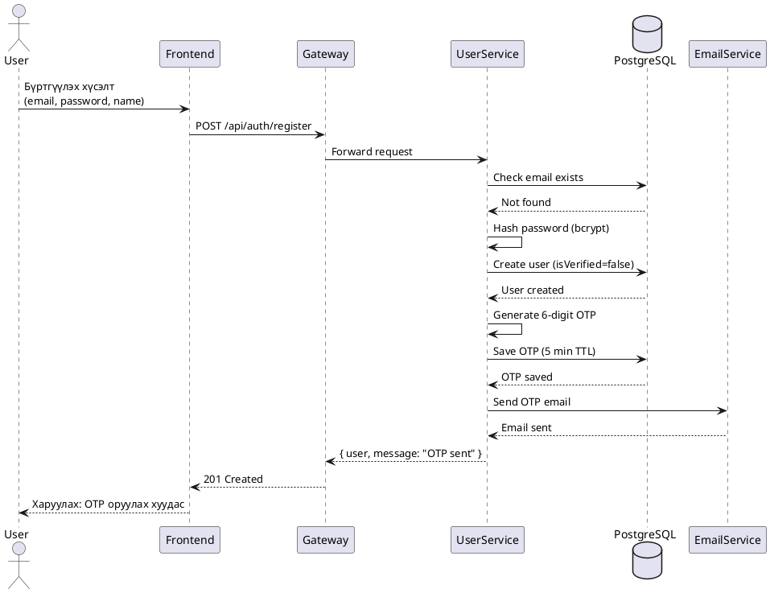
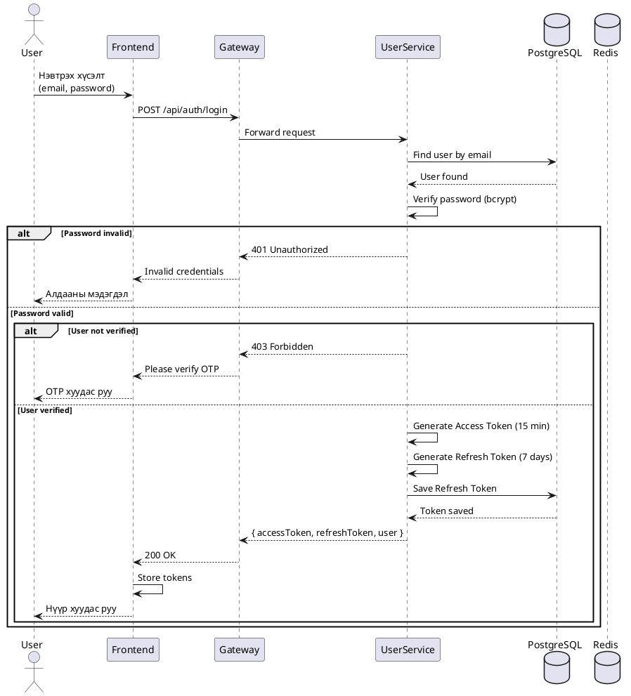
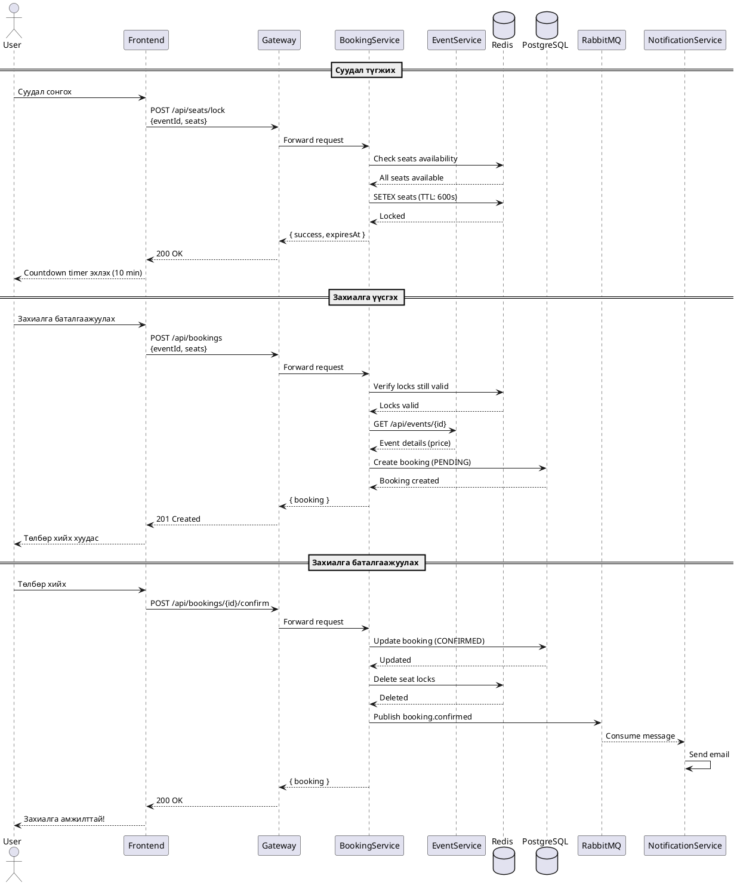
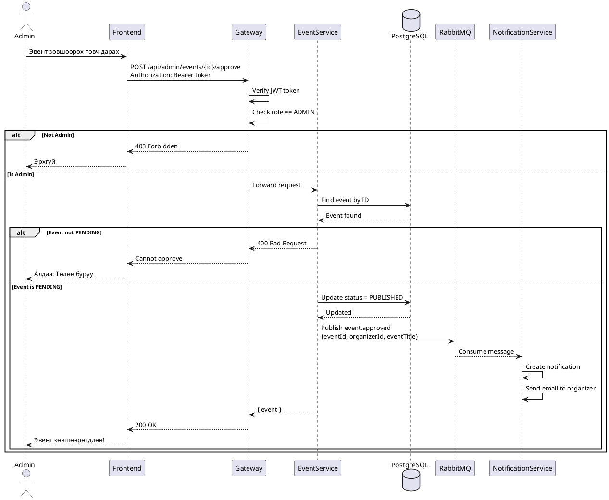
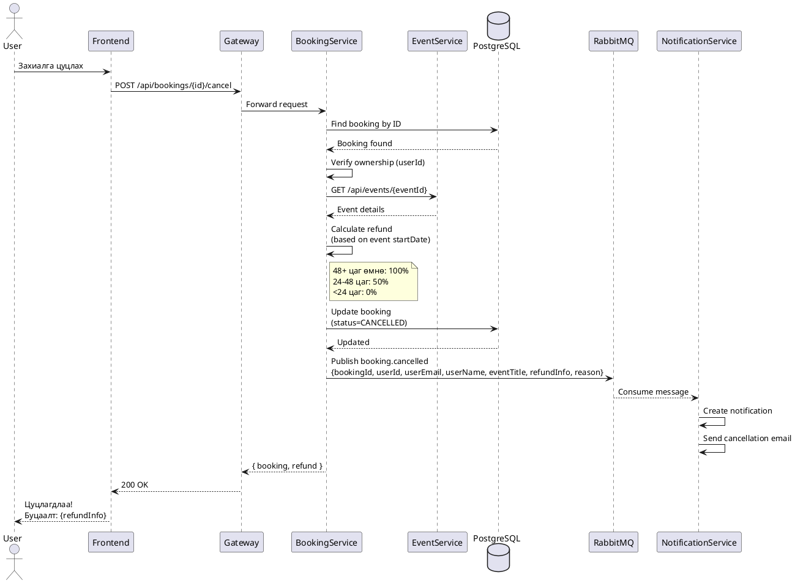
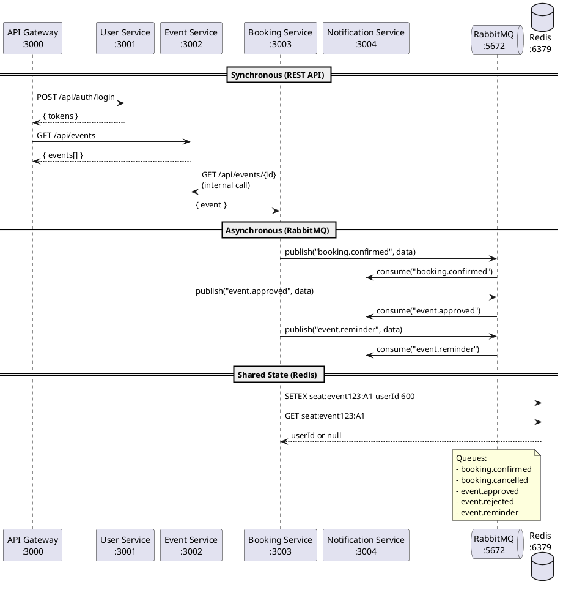

# Sequence Diagrams

## 1. Бүртгүүлэх (User Registration)



### ASCII Diagram
```
┌──────┐          ┌──────────┐          ┌─────────┐          ┌────────────┐          ┌────────────┐          ┌────────────┐
│ User │          │ Frontend │          │ Gateway │          │UserService │          │ PostgreSQL │          │EmailService│
└──┬───┘          └────┬─────┘          └────┬────┘          └─────┬──────┘          └─────┬──────┘          └─────┬──────┘
   │                   │                     │                     │                       │                       │
   │ Бүртгүүлэх хүсэлт │                     │                     │                       │                       │
   │──────────────────>│                     │                     │                       │                       │
   │                   │                     │                     │                       │                       │
   │                   │ POST /api/auth/register                   │                       │                       │
   │                   │────────────────────>│                     │                       │                       │
   │                   │                     │                     │                       │                       │
   │                   │                     │ Forward request     │                       │                       │
   │                   │                     │────────────────────>│                       │                       │
   │                   │                     │                     │                       │                       │
   │                   │                     │                     │ Check email exists    │                       │
   │                   │                     │                     │──────────────────────>│                       │
   │                   │                     │                     │                       │                       │
   │                   │                     │                     │      Not found        │                       │
   │                   │                     │                     │<──────────────────────│                       │
   │                   │                     │                     │                       │                       │
   │                   │                     │                     │ Hash password         │                       │
   │                   │                     │                     │───────┐               │                       │
   │                   │                     │                     │       │               │                       │
   │                   │                     │                     │<──────┘               │                       │
   │                   │                     │                     │                       │                       │
   │                   │                     │                     │ Create user           │                       │
   │                   │                     │                     │──────────────────────>│                       │
   │                   │                     │                     │                       │                       │
   │                   │                     │                     │    User created       │                       │
   │                   │                     │                     │<──────────────────────│                       │
   │                   │                     │                     │                       │                       │
   │                   │                     │                     │ Generate OTP          │                       │
   │                   │                     │                     │───────┐               │                       │
   │                   │                     │                     │       │               │                       │
   │                   │                     │                     │<──────┘               │                       │
   │                   │                     │                     │                       │                       │
   │                   │                     │                     │ Save OTP              │                       │
   │                   │                     │                     │──────────────────────>│                       │
   │                   │                     │                     │                       │                       │
   │                   │                     │                     │ Send OTP email        │                       │
   │                   │                     │                     │──────────────────────────────────────────────>│
   │                   │                     │                     │                       │                       │
   │                   │                     │                     │      Email sent       │                       │
   │                   │                     │                     │<──────────────────────────────────────────────│
   │                   │                     │                     │                       │                       │
   │                   │                     │   201 Created       │                       │                       │
   │                   │                     │<────────────────────│                       │                       │
   │                   │                     │                       │                       │                       │
   │                   │ 201 + OTP хуудас    │                     │                       │                       │
   │                   │<────────────────────│                     │                       │                       │
   │                   │                     │                     │                       │                       │
   │ OTP оруулах хуудас│                     │                     │                       │                       │
   │<──────────────────│                     │                     │                       │                       │
   │                   │                     │                     │                       │                       │
```

---

## 2. Нэвтрэх (User Login)



### ASCII Diagram
```
┌──────┐          ┌──────────┐          ┌─────────┐          ┌────────────┐          ┌────────────┐
│ User │          │ Frontend │          │ Gateway │          │UserService │          │ PostgreSQL │
└──┬───┘          └────┬─────┘          └────┬────┘          └─────┬──────┘          └─────┬──────┘
   │                   │                     │                     │                       │
   │ email, password   │                     │                     │                       │
   │──────────────────>│                     │                     │                       │
   │                   │                     │                     │                       │
   │                   │ POST /api/auth/login│                     │                       │
   │                   │────────────────────>│                     │                       │
   │                   │                     │                     │                       │
   │                   │                     │ Forward request     │                       │
   │                   │                     │────────────────────>│                       │
   │                   │                     │                     │                       │
   │                   │                     │                     │ Find user by email    │
   │                   │                     │                     │──────────────────────>│
   │                   │                     │                     │                       │
   │                   │                     │                     │     User found        │
   │                   │                     │                     │<──────────────────────│
   │                   │                     │                     │                       │
   │                   │                     │                     │ Verify bcrypt         │
   │                   │                     │                     │───────┐               │
   │                   │                     │                     │       │ Valid         │
   │                   │                     │                     │<──────┘               │
   │                   │                     │                     │                       │
   │                   │                     │                     │ Generate tokens       │
   │                   │                     │                     │───────┐               │
   │                   │                     │                     │       │               │
   │                   │                     │                     │<──────┘               │
   │                   │                     │                     │                       │
   │                   │                     │                     │ Save refresh token    │
   │                   │                     │                     │──────────────────────>│
   │                   │                     │                     │                       │
   │                   │                     │  { tokens, user }   │                       │
   │                   │                     │<────────────────────│                       │
   │                   │                     │                     │                       │
   │                   │ 200 OK + tokens     │                     │                       │
   │                   │<────────────────────│                     │                       │
   │                   │                     │                     │                       │
   │  Нүүр хуудас      │                     │                     │                       │
   │<──────────────────│                     │                     │                       │
```

---

## 3. Захиалга хийх (Booking Flow)



### ASCII Diagram (Simplified)
```
┌──────┐       ┌──────────┐       ┌─────────┐       ┌──────────────┐       ┌───────┐       ┌────────────┐       ┌──────────┐
│ User │       │ Frontend │       │ Gateway │       │BookingService│       │ Redis │       │ PostgreSQL │       │ RabbitMQ │
└──┬───┘       └────┬─────┘       └────┬────┘       └──────┬───────┘       └───┬───┘       └─────┬──────┘       └────┬─────┘
   │                │                  │                   │                   │                 │                   │
   │ ═══════════════════════════════ СУУДАЛ ТҮГЖИХ ═══════════════════════════════════════════════════════════════ │
   │                │                  │                   │                   │                 │                   │
   │ Суудал сонгох  │                  │                   │                   │                 │                   │
   │───────────────>│                  │                   │                   │                 │                   │
   │                │ POST /seats/lock │                   │                   │                 │                   │
   │                │─────────────────>│                   │                   │                 │                   │
   │                │                  │ Forward           │                   │                 │                   │
   │                │                  │──────────────────>│                   │                 │                   │
   │                │                  │                   │ Check availability│                 │                   │
   │                │                  │                   │──────────────────>│                 │                   │
   │                │                  │                   │ Available         │                 │                   │
   │                │                  │                   │<──────────────────│                 │                   │
   │                │                  │                   │ SETEX (10 min TTL)│                 │                   │
   │                │                  │                   │──────────────────>│                 │                   │
   │                │                  │                   │ Locked            │                 │                   │
   │                │                  │                   │<──────────────────│                 │                   │
   │                │                  │ { expiresAt }     │                   │                 │                   │
   │                │                  │<──────────────────│                   │                 │                   │
   │                │ 200 OK           │                   │                   │                 │                   │
   │                │<─────────────────│                   │                   │                 │                   │
   │ Timer: 10:00   │                  │                   │                   │                 │                   │
   │<───────────────│                  │                   │                   │                 │                   │
   │                │                  │                   │                   │                 │                   │
   │ ═══════════════════════════════ ЗАХИАЛГА БАТАЛГААЖУУЛАХ ═════════════════════════════════════════════════════ │
   │                │                  │                   │                   │                 │                   │
   │ Баталгаажуулах │                  │                   │                   │                 │                   │
   │───────────────>│                  │                   │                   │                 │                   │
   │                │POST /bookings/confirm                │                   │                 │                   │
   │                │─────────────────>│                   │                   │                 │                   │
   │                │                  │──────────────────>│                   │                 │                   │
   │                │                  │                   │ Verify locks      │                 │                   │
   │                │                  │                   │──────────────────>│                 │                   │
   │                │                  │                   │ Valid             │                 │                   │
   │                │                  │                   │<──────────────────│                 │                   │
   │                │                  │                   │ Create booking    │                 │                   │
   │                │                  │                   │────────────────────────────────────>│                   │
   │                │                  │                   │ Created           │                 │                   │
   │                │                  │                   │<────────────────────────────────────│                   │
   │                │                  │                   │ Publish event     │                 │                   │
   │                │                  │                   │─────────────────────────────────────────────────────────>
   │                │                  │ { booking }       │                   │                 │                   │
   │                │                  │<──────────────────│                   │                 │                   │
   │                │ 200 OK           │                   │                   │                 │                   │
   │                │<─────────────────│                   │                   │                 │                   │
   │ Амжилттай!     │                  │                   │                   │                 │                   │
   │<───────────────│                  │                   │                   │                 │                   │
```

---

## 4. Эвент зөвшөөрөх (Admin Approve Event)



---

## 5. Захиалга цуцлах (Cancel Booking)



---

## 6. Microservices хоорондын харилцаа (Inter-service Communication)



### ASCII Diagram
```
                              ┌─────────────────────────────────────────────────────────────────┐
                              │                    SYNCHRONOUS (REST API)                       │
                              └─────────────────────────────────────────────────────────────────┘
                                                          │
        ┌──────────────┐                                  │                                  
        │              │                                  ▼                                  
        │    Client    │──────────────────────────> ┌──────────┐                            
        │   (Browser)  │                            │ Gateway  │                            
        │              │<────────────────────────── │  :3000   │                            
        └──────────────┘                            └────┬─────┘                            
                                                         │                                  
                                 ┌───────────────────────┼───────────────────────┐          
                                 │                       │                       │          
                                 ▼                       ▼                       ▼          
                          ┌──────────┐            ┌──────────┐            ┌──────────┐     
                          │   User   │            │  Event   │            │ Booking  │     
                          │ Service  │            │ Service  │<───────────│ Service  │     
                          │  :3001   │            │  :3002   │  internal  │  :3003   │     
                          └──────────┘            └──────────┘    API     └────┬─────┘     
                                                                               │           
                                                                               │           
                              ┌─────────────────────────────────────────────────────────────────┐
                              │                   ASYNCHRONOUS (RabbitMQ)                       │
                              └─────────────────────────────────────────────────────────────────┘
                                                          │
                                                          ▼
        ┌──────────┐         ┌──────────┐         ┌──────────────┐         ┌──────────────┐
        │  Event   │ publish │          │ consume │ Notification │  email  │    User      │
        │ Service  │────────>│ RabbitMQ │────────>│   Service    │────────>│   (Email)    │
        │          │         │  :5672   │         │    :3004     │         │              │
        └──────────┘         │          │         └──────────────┘         └──────────────┘
        ┌──────────┐ publish │          │                                                  
        │ Booking  │────────>│          │                                                  
        │ Service  │         └──────────┘                                                  
        └────┬─────┘                                                                       
             │                                                                              
             │               ┌─────────────────────────────────────────────────────────────────┐
             │               │                    SHARED STATE (Redis)                         │
             │               └─────────────────────────────────────────────────────────────────┘
             │                                         │
             │                                         ▼
             │                                  ┌──────────────┐
             └─────────────────────────────────>│    Redis     │
                         seat locking           │    :6379     │
                                                │              │
                                                │ seat:e1:A1   │
                                                │ seat:e1:A2   │
                                                │ seat:e1:B1   │
                                                └──────────────┘
```

---

## Message Queue Flows

| Queue Name | Publisher | Consumer | Payload |
|------------|-----------|----------|---------|
| booking.confirmed | Booking Service | Notification Service | { bookingId, userId, eventId, seats, totalAmount } |
| booking.cancelled | Booking Service | Notification Service | { bookingId, userId, refundInfo, reason } |
| event.approved | Event Service | Notification Service | { eventId, organizerId, eventTitle } |
| event.rejected | Event Service | Notification Service | { eventId, organizerId, eventTitle, reason } |
| event.reminder | Booking Service (reminder scheduler) | Notification Service | { bookingId, eventId, userId, userEmail, userName, eventTitle, eventDate, venueName, sentAt } |
