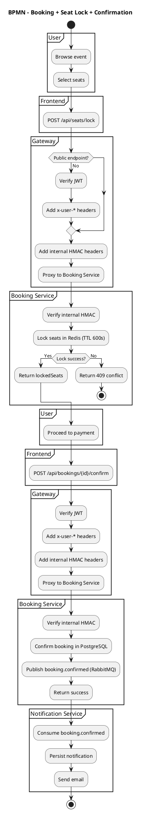
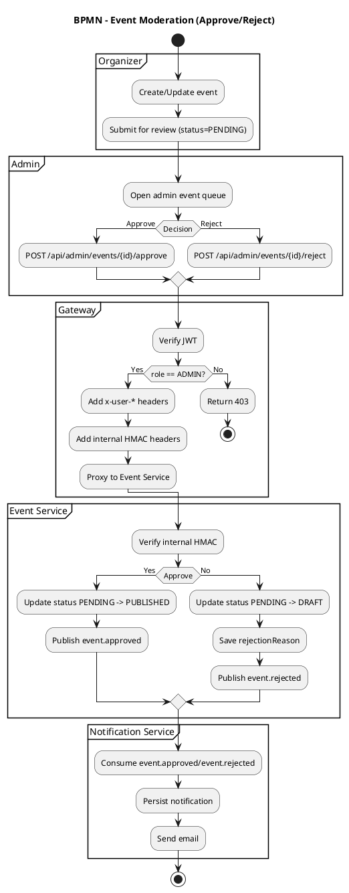

# 07. BPMN Diagrams

This document adds BPMN-style diagrams for core EventMN flows.

Note: These diagrams are written as PlantUML activity diagrams (BPMN-like), because the rest of the docs already use PlantUML.

## 1) Booking + Seat Lock + Confirmation

## 2) Event Moderation (Admin Approve / Reject)

